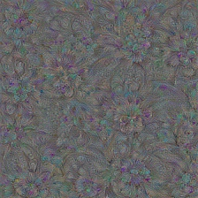
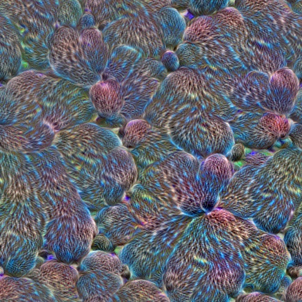
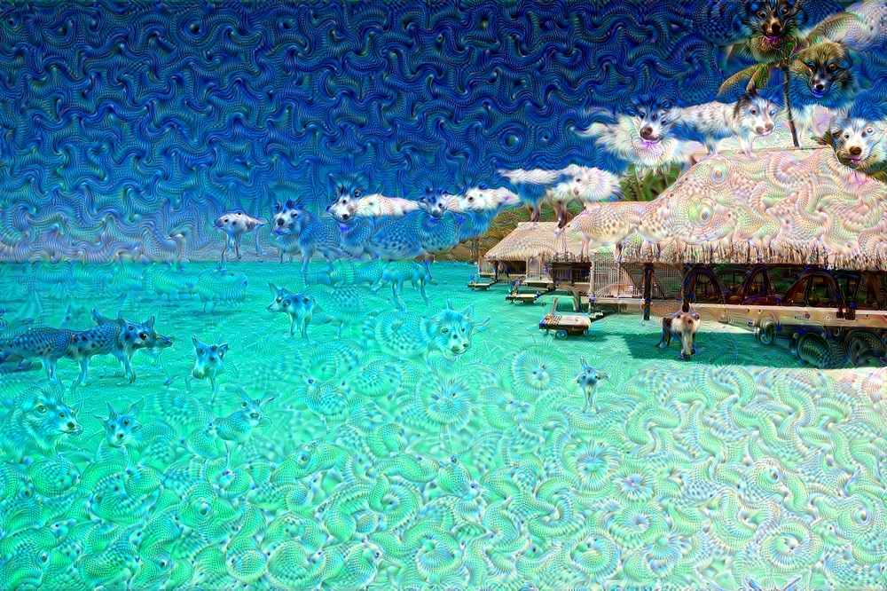

### Deep Dream

- Deep Dream 是Google公司在2015年公布的一项技术,他主要用来做神经网络提取特征的可视化.
- 具体来说, 一个神经网络A, 我们的输入是一副图像,输出是一个概率. 在训练A的时候,我们使用梯度下降法来使得Loss最小.
- 那么对于一个已经训练好的模型来说,我们怎么可视化某一个卷积层提取的到的特征呢? 我们可以固定网络的参数,通过反向传播 + 计算梯度, 来不断改变输入图像的值,使得某一个该概率最大.那么最后经过N轮迭代得到的图像,就是对该卷积层特征的可视化.
- 
- 
- 